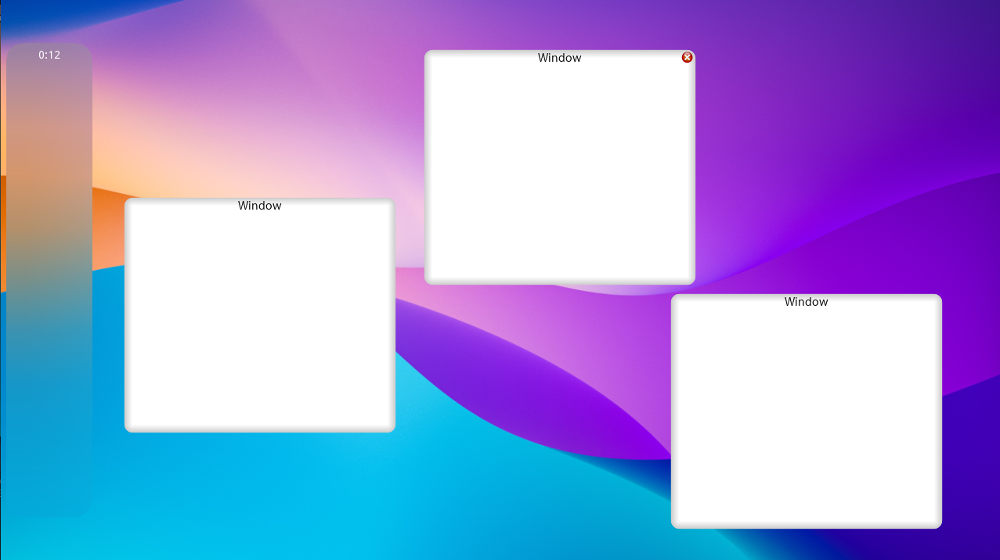

# G12

The second generation of the **GWM**. (G Window Manager)

This version is much more GPU-intensive therefore it requires a much better hardware than **g11**. But this version
of the G Window System is much prettier, and much more isolated, **g11** was exclusive for the magicOS project. 
You can use **g12** in any project you'd like, without the need for extraction.

(*the theme, minimalist.*)

This repository comes with

- **g12** window manager
- **g12** based application handler
- **g12** applets
- example **g12** projects

If you are looking for more hardware-friendly versions, we have the [gX window system](https://github.com/thekaigonzalez/gX),
and if you really want it, you could try and extract the older **g11** window manager from the [magicOS](https://github.com/thekaigonzalez/g11) repository.